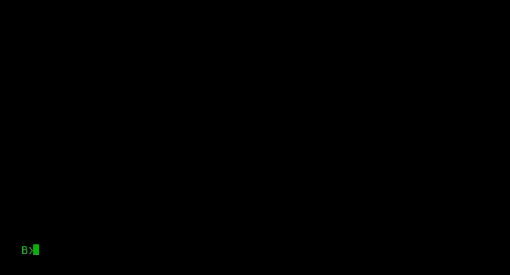
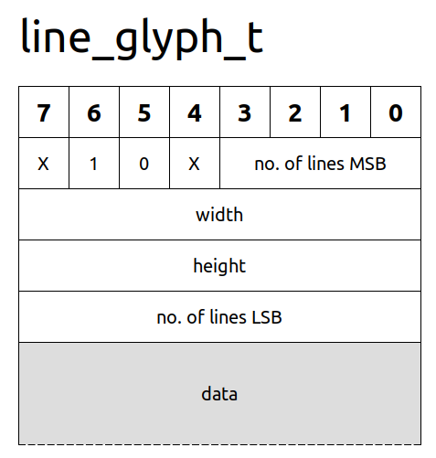

![status.badge] [![language.badge]][language.url] [![standard.badge]][standard.url] [![license.badge]][license.url]

# Animate

The **Animate** is the animation player for the Iskra Delta Partner computer.

## Compiling

To build the *Animate*, you will need a *Linux* machine with the latest version of the *SDCC suite* and *cpmtools*.

To download all required submodules, clone this repository with the `--recursive` switch:

~~~
git clone https://github.com/tstih/idp-animate.git --recursive
~~~

Use `make` to build Animate. Afterwards, you will find the disk image `fddb.img` with sample animations and the executables in the `bin/` directory.

## Running

The name of the animation `*.A` file is the first command line argument for Animate.

## *.A File Format

An animation file uses the .A extension. It has the animation header and animation frames.

### Animation Header

The animation header data structure is provided below. It begins with two "magic" bytes that contain the uppercase letters 'A' and 'N', followed by a single-byte format. This is followed by the width and height of the animation, which are 16 bits each, and a byte that contains the number of frames.

~~~cpp
typedef struct animation_s {
    uint16_t magic;
    uint8_t format;
    uint16_t width;
    uint16_t height;
    uint8_t frames;
    uint16_t offsets[];
} animation_t;
~~~

### Pointers to Frames

The animation header is succeeded by a table of offsets to frame data within the file. The first offset is always zero, while the next offset is the size of the first frame.

The table of offsets has as many records as there are frames, and each record is two bytes in length.

### Frames

After the table of offsets, the frames are included. Each frame is a glyph. You can use either the `TINY` or `LINES` glyph formats, although Animate has only been tested with the `LINES` format.

All Partner glyph formats support glyphs up to 256x256. However, since the ugpx library doesn't support clipping, the drawing functions don't verify the actual glyph size. As a result, it is theoretically possible to have larger glyphs. 

Here is the LINES glyph header.

The 12-bit `number of lines` value specifies how many bytes follow the glyph header. The width and height are each represented by 1 byte. If the values exceed 255, set both of them to 0. Animate will ignore them.

The bytes are signed, giving a range of -128 to 127. Every two bytes indicate the x and y coordinates of a relative line from the current position to the new position. The value of -128 is utilized as an escape sequence and must be followed by a command.

Here is the table of commands.

| Code (bin)  | Command                       |
|:-----------:|:------------------------------|
| 0000 00 0 0 | End of current stroke.        |
| 0000 xx 0 0 |	Reserved                      |
| 0000 00 1 0 |	End of stroke, no color       |
| 0000 01 1 0 |	End of stroke, set fore color |
| 0000 10 1 0 |	End of stroke, set back color |
| 0000 11 1 0 |	Reserved                      |
| 0000 00 1 1 |	Set color to transparent      |
| 0000 01 1 1 |	Set fore color                |
| 0000 10 1 1 |	Set back color                |
| 0000 11 1 1 |	Reserved                      |

 > The first bit (Bit 0) indicates whether the stroke continues (=1) or ends (=0). The second bit (Bit 1) indicates whether the pen changes. Bits 3 and 4 specify the new pen. The top nibble is reserved for additional commands.

So let's decode the following sequence:

~~~asm
        .db -128            ; escape sequence
        .db 0               ; command = end of stroke
        ;; first 2 stroke bytes are initial x,y
        .db 10, 10          ; start drawing from 10,10
        ;; coordinates are relative and added to current coord.
        .db 20, 0           ; draw line from 10,10 to 30,10
        .db 0, -10          ; draw line from 30,10 to 30,0
        .db -128            ; escape sequence
        .db 3               ; set color to transparent
        .db -20,10          ; move back to 10,10 (no drawing)
~~~

For more examples, please explore the animations in this project's [extras](disk/extras/) directory.

[language.url]:   https://en.wikipedia.org/wiki/ANSI_C
[language.badge]: https://img.shields.io/badge/language-C-blue.svg

[standard.url]:   https://en.wikipedia.org/wiki/C89/
[standard.badge]: https://img.shields.io/badge/standard-C89-blue.svg

[license.url]:    https://github.com/tstih/libcpm3-z80/blob/main/LICENSE
[license.badge]:  https://img.shields.io/badge/license-MIT-blue.svg

[status.badge]:  https://img.shields.io/badge/status-stable-dkgreen.svg